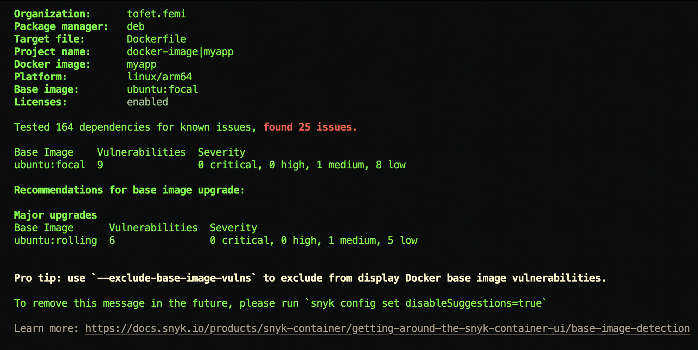
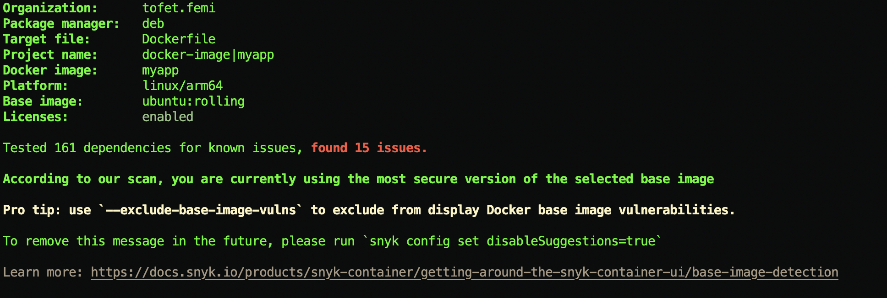

1. Write a Dockerfile to run nginx version 1.19 in a container.
    Choose a base image of your liking.
    I choose Ubuntu:focal and
    for deployment I am currently using ARM64

2. command used for executing:
`sudo docker build -t myapp . `

`docker run -d -p 8181:8080 myapp`

Question: The build should be security conscious and ideally pass a container
image security test. [20 pts]

3. For checking security vulnerabilities I used "snyk"
`snyk container test myapp --file=Dockerfile`

## This is using nginx 1.18

## This is using the recommended image 
